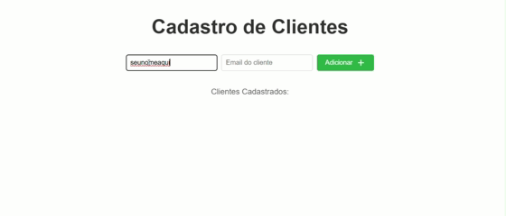

[](LICENSE)

# Lista de Tarefas



## Descrição

Este projeto é uma aplicação simples para gerenciamento de tarefas, desenvolvida como exercício prático para a EBAC.

## Funcionalidades

- Listar tarefas cadastradas
- Adicionar novas tarefas
- Editar tarefas existentes
- Remover tarefas
- Marcar tarefas como concluídas

## Tecnologias Utilizadas

- HTML5
- CSS3
- JavaScript (ES6)
- CrudCrud

## Como Executar

1. Clone o repositório:
    ```bash
    git clone https://github.com/saarrr-alves/Listagem_Cadastro_Clientes.git
    ```
2. Navegue até a pasta do projeto:
    ```bash
    cd listagem_cadastro_clientes
    ```
3. Abra o arquivo `index.html` em seu navegador.

## Estrutura de Pastas

```
/
├── index.html
├── style.css
├── script.js
└── README.md
└── previa.gif
```

## Próximos passos (Roadmap)
- Implementar autenticação e validação dos valores inseridos nos inputs, garantindo que apenas dados corretos sejam aceitos (por exemplo, validação de formato de e-mail)
- Estilo responsivo com layout mobile-first ou tailwind/bootstrap
- Testes automatizados com Jest ou Cypress

## Contribuição

Sinta-se à vontade para abrir issues ou enviar pull requests.

## Licença

Este projeto está licenciado sob a licença MIT.